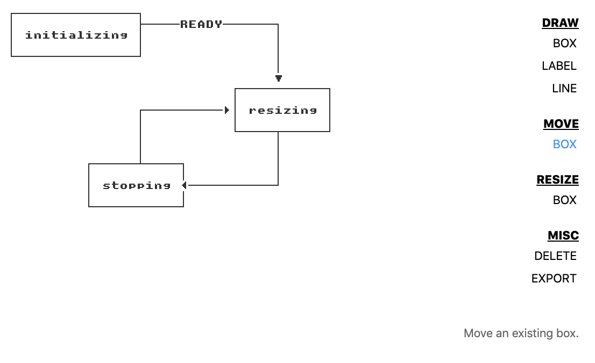

# ascii-diagrams

ascii diagramming done right




Despite there being a number of grid rendering modules, I couldn't find satisfying all criteria:

* **is not blurry on retina screens**
* no anti-aliasing
* **60fps rendering performance**
* produces nice looking ascii that can be embedded in code, markdown, etc.


so here we are.


## installation

```
npm install
npm start
```


### TODO
* make complicated states like line_drawing and labeling nested state machines
* implement move label
* implement edit label
* implement move line
* on window resize, increase grid columns/rows when it doesn't at least cover the window viewport
* undo/redo
* explore control plane concept
