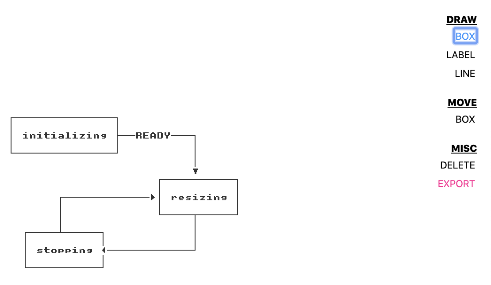

# ascii-diagrams

ascii diagramming done right




Despite there being a number of grid rendering modules, I couldn't find satisfying all criteria:

* **is not blurry on retina screens**
* no anti-aliasing
* **60fps rendering performance**
* produces nice looking ascii that can be embedded in code, markdown, etc.


so here we are.


## installation

```
npm install
npm start
```


### TODO
* resize box action
* overlay active control indicators (e.g., when resizing a box, highlight the draggable corners)
* keyboard shortcuts
* make complicated states like line_drawing and labeling nested state machines
* move line action
* undo/redo
* explore control plane concept
