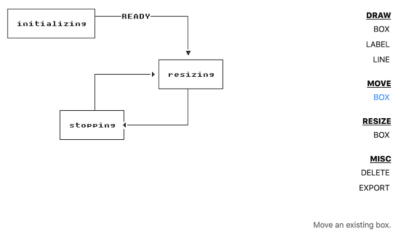

# ascii-diagrams

no bullshit ascii diagramming https://diagrams.reinstein.me

I couldn't find any grid rendering modules satisfying all of these criteria:

* **is not blurry on retina screens**
* no anti-aliasing
* **60fps rendering performance**
* produces nice looking ascii that can be embedded in code, markdown, etc.

so here we are.

## usage

serve this directory with a webserver and open `index.html` in a browser.

### TODO

* highlight item to move under the mouse cursor (label, box)
* highlight item to delete under mouse cursor (label, line, box)
* make the active command stand out more
* clicking outside the export window should close it
* show backdrop behind export modal
* implement delete text
* combine `move box` and `move label` into a single command
* on window resize, increase grid columns/rows when it doesn't at least cover the window viewport
* implement edit label
* implement move line
* undo/redo
